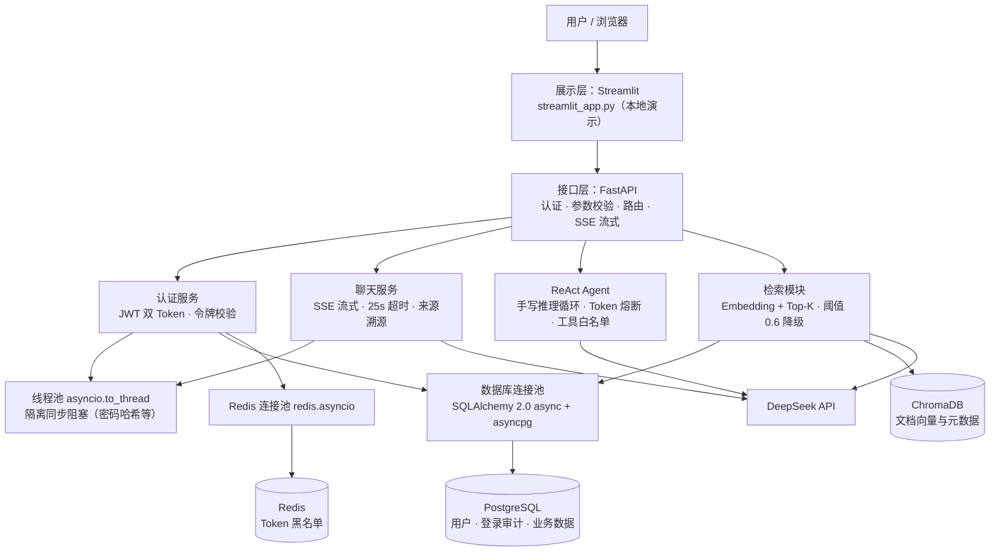
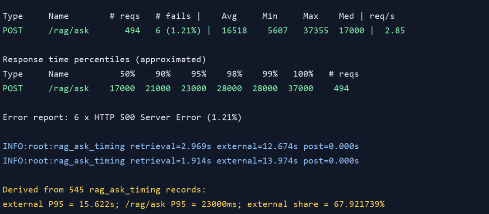

# FastAPI AI 应用后端

一个带完整认证、RAG 检索和 ReAct Agent 的 FastAPI 后端，已部署在 <https://baisonghao.website>，接口文档见 `/docs`（演示账号 `demo / demo123`）。

## 功能

- 认证：注册 + 邮箱激活、登录、JWT 双 Token（access + refresh）、登出（Redis 黑名单）
- AI 对话：SSE 流式输出，25s 超时兜底，回答附带检索来源
- RAG：ChromaDB 向量检索（余弦空间），距离归一化 + 0.6 相似度阈值，低相关自动降级纯模型回答
- Agent：手写 ReAct 推理循环（没有用 LangChain），max_iter=5 + Token 累计熔断；工具：RAG 检索 / 网络搜索 / 计算器 / Python 执行器（模块白名单沙箱）
- 可观测：JSON 结构化日志（stdout）、loguru 链路耗时、请求耗时中间件（X-Process-Time）
- 迁移：Alembic（0001 users，0002 login_logs 登录审计）

## 技术栈

FastAPI · SQLAlchemy 2.0（async）· PostgreSQL / SQLite · ChromaDB · Redis（Upstash）· DeepSeek · Docker / Railway

## 架构



## 快速开始

```bash
python -m venv venv
venv\Scripts\activate        # Windows；Linux/macOS 用 venv/bin/activate
pip install -r requirements.txt
# 按需配置 .env（本地开发不配 DATABASE_URL 会用 SQLite）
uvicorn main:app --reload
```

启动时自动完成三件事：SQLAlchemy 幂等建表、创建演示账号、检查向量库（旧 L2 集合自动重建为 cosine 并灌入 `documents/` 下的文档）。

## 环境变量

| 变量 | 说明 | 默认 |
| --- | --- | --- |
| `DATABASE_URL` | PostgreSQL 连接串，不配则本地 SQLite | `sqlite+aiosqlite:///test.db` |
| `SECRET_KEY` | JWT 签名密钥 | 开发默认值（生产必须改） |
| `DEEPSEEK_API_KEY` | DeepSeek 对话 / Agent | - |
| `SILICONFLOW_API_KEY` | RAG 嵌入（BAAI/bge-large-zh-v1.5） | - |
| `REDIS_URL` | Upstash / 托管 Redis（`rediss://` 或 `redis://`） | - |
| `REDIS_HOST` `REDIS_PORT` `REDIS_PASSWORD` `REDIS_DB` | Redis 独立配置（没有 REDIS_URL 时用） | `localhost:6379` |
| `BASE_URL` | 激活链接前缀 | `https://baisonghao.website` |
| `REFRESH_TOKEN_EXPIRE_MINUTES` | refresh token 有效期 | `10080`（7 天） |
| `RAG_REBUILD_TOKEN` | 手动触发向量库重建接口的鉴权 | 空 = 接口禁用 |

## 接口

前缀 `/api/v1`，除 register / activate / login 外都需要 `Authorization: Bearer <token>`。

| 方法 | 路径 | 说明 |
| --- | --- | --- |
| POST | `/register` | 注册，返回激活链接 |
| GET | `/activate?token=` | 激活账号 |
| POST | `/login` | 登录，返回 access + refresh |
| POST | `/refresh` | refresh 换新 access |
| POST | `/logout` | 登出，access 进黑名单 |
| GET | `/users/me` | 当前用户（含最近登录时间） |
| POST | `/chat` | SSE 流式对话，带来源溯源 |
| POST | `/agent` | ReAct Agent |
| POST | `/rag/retrieve` | 检索，返回片段 + 相似度分数 |
| POST | `/rag/ask` | 检索 + 模型回答（阈值降级） |
| POST | `/rag/local_search` | 纯本地检索（压测用） |

## 踩过的坑

- **Upstash 强制 TLS**：`redis://` 连接被服务端直接关闭（`Connection closed by server`），改用 `rediss://` 协议解决；所有连接加 5s 超时，避免连不上时启动卡死。redis-py 5.x 的 `from_url` 不支持 `ssl=` 参数，TLS 要用 `rediss://` 协议写
- **chromadb metadata 会撒谎**：`get_or_create_collection` 会悄悄改写已存在集合的 metadata，看起来是 cosine 实际还是 L2。用自有标记 `dsh_schema` 记录真实检索空间，旧库启动时自动删除重建
- **向量库增量维护**：文档新增/改写后，启动时按内容 id 增量补灌并清理过期片段，不需要手动重建
- **SQLite 事务**：连接串走 `aiosqlite`，异步 ORM 与同步建表并存，启动时幂等建表

## 性能测试

压测条件：Locust，50 并发，持续 3 分钟，覆盖 `/rag/ask`（正式压测前手动预热 10 次）。

| 指标 | `/rag/ask` |
| --- | --- |
| 请求数 | 494 |
| 失败 | 6（1.21%） |
| 平均耗时 | 16519 ms |
| P95 | 23000 ms |
| P99 | 28000 ms |
| 最大 | 37356 ms |



分段日志（`rag_ask_timing`）显示 external（DeepSeek 调用）的 P95 为 15.6s，占接口 P95 的 67.9%，瓶颈在外部 LLM，不在检索。

### 登录接口压测（2026-08-17 实测）

压测方法：50 并发，持续 30 秒，直压登录接口（demo 账号）。优化前后对比：

| 阶段 | 单请求 P50 | 50 并发 P95 | 失败率 |
| --- | --- | --- | --- |
| SQLite + 哈希 rounds=535000 | 527 ms | 10.3 s（伴随 `database is locked`） | 66% |
| PostgreSQL + 旧哈希 | 612 ms | 13.4 s | 0% |
| **PostgreSQL + rounds=60000 + 线程池16/连接池10** | **408 ms** | **2.0 s** | **0%** |

主要优化：① 数据库从 SQLite 迁移到 PostgreSQL（SQLite 并发写锁会连读请求一起阻塞）；② 密码哈希成本 rounds 535000 → 60000（单次验证 457ms → 51ms）；③ `asyncio.to_thread` 线程池 8 → 16、连接池 5+5 → 10+10。登录审计写入做了降级容错，写失败不影响登录主流程。

## RAG 效果评估

150 条测试问题（100 条文档内、50 条文档外），人工标注对比纯模型与 RAG 的回答准确率：

- 纯模型 61% → RAG 79%，相对提升 29.5%
- 测试集仍在扩充中

## 部署

- **Railway（当前）**：`nixpacks.toml` + `Procfile`，PostgreSQL + Upstash Redis + 环境变量
- **Docker**：仓库自带 `Dockerfile`（streamlit 演示版）和 `docker-compose.yml`（FastAPI + Redis 双容器）

## 知识库维护

文档放进 `documents/`（txt / md，空行分段），重启服务自动增量入库，不用手动重建向量库。
